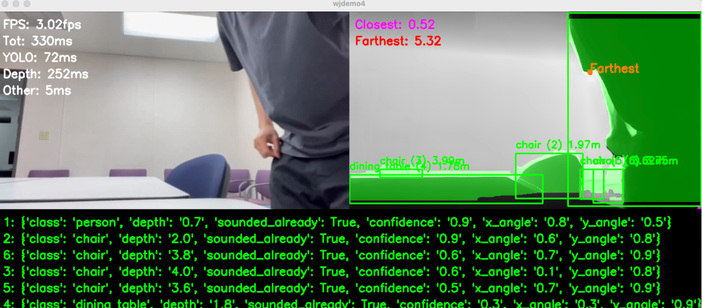

# CViSion

CViSion is a deep learning based Python program designed to assist the visually-impaired in navigating their surroundings. Real-time video from a portable camera is processed to generate directional sound cues to be heard on headphones. These sounds reflect the relative locations and distances of detected objects. Potential dangers such as very close objects are alerted to the user.

<table>
<tr>
<td width="35%"></td>
<td width="65%"></td>
</tr>
</table>

**[Watch the trailer](https://www.youtube.com/watch?v=NxqoAR_yYxM)** · **[UCSB capstone project page](https://capstone.engineering.ucsb.edu/projects/cvision)** · **[Winter design report (PDF)](winter_report/CVision_Shiv_winter_design_packet.pdf)**

## Installation

Run these from the project root:

```bash
# 1. Create the environment
conda create -n cvision python=3.11 -y
conda activate cvision

# 2. Install PyTorch first (Windows + NVIDIA: see note below)
pip install torch torchvision

# 3. Install the other dependencies
pip install -r requirements.txt

# 4. Download the models
git clone https://github.com/DepthAnything/Depth-Anything-V2 DA2
./checkpoints/download_ckpts.sh
```

**Windows + NVIDIA GPU:** in step 2, use this instead (the command we tested, CUDA 12.1):
```bash
pip install torch torchvision --index-url https://download.pytorch.org/whl/cu121
```
If that doesn't match your GPU driver, get the right command from [pytorch.org](https://pytorch.org/get-started/locally/). On Mac and Linux, the plain command already uses your GPU.

The YOLO model (`checkpoints/yolov8x-seg.pt`) downloads automatically on the first run.

## Running

```bash
python main.py
```
Always run it from the project root, because file paths are relative to it.

### Controls

Wear headphones (the audio is spatial). Type commands in the **terminal** and press Enter.

| Type | What it does |
|---|---|
| `0` | Main mode (default). Announces new objects; dangerous or very close objects trigger a warning. Typing `0` again re-announces everything. |
| `1` | Pick a target to be guided to (the program calls this "voice mode"). Then type one of: |
| &nbsp;&nbsp;↳ *(just Enter)* | List the detected objects and their IDs, then return to main mode |
| &nbsp;&nbsp;↳ `5` | Guide to object ID 5 (IDs appear in the video window, e.g. `chair (5)`) |
| &nbsp;&nbsp;↳ `a7` | Guide to ArUco marker 7 |
| &nbsp;&nbsp;↳ `0` | Cancel |
| `quit` | Exit (or press `q` in the video window) |

While guiding, a tone plays from the target's direction and gets louder as you get closer. It stops when you're within about 1.3 m, or if the target is lost. Type `0` to cancel.

**Testing ArUco markers:** open any image in [`assets/aruco_markers`](assets/aruco_markers) on your phone or print it, and hold it up to the camera. The file name is the marker ID (`marker_id_7.png` is `a7`).

The small "phone" window is a mock-up of the phone app: click the square to re-announce objects, double-click it to do the same as typing `1`.

## Features

<!-- TODO: fill in -->
- Normal mode: 
- Guide (tracking) mode: 
- Danger mode: 
- ArUco markers: printable markers are in `assets/aruco_markers` (DICT_4X4_50, IDs 0-49)

<details>
<summary><b>Settings</b></summary>

<!-- TODO: fill in. Key ones in my_constants.py: -->
- `WEBCAM_PATH`: camera index or video file
- `MIRROR_WEBCAM`: `True` for a laptop webcam facing you, `False` for a camera facing outward
- `DANGER_METER`, `ALWAYS_IGNORE`, `IGNORE_OBJECTS`

</details>

<details>
<summary><b>Project structure</b></summary>

<!-- TODO: fill in -->
```
main.py          # entry point
my_constants.py  # settings
globals.py       # shared state
cvision/         # 
assets/          # 
checkpoints/     # model weights (downloaded, not in git)
DA2/             # Depth-Anything-V2 (cloned, not in git)
demos/           # old demos, kept for reference
winter_report/   # 
```

</details>

<details>
<summary><b>Troubleshooting and known warnings</b></summary>

- **Check PyTorch sees your GPU:** `python -c "import torch; print('CUDA:', torch.cuda.is_available(), 'MPS:', torch.backends.mps.is_available())"`. The program uses CUDA, then MPS (Mac), then CPU.
- **Mac: PyTorch error about an unsupported MPS operation.** Run `export PYTORCH_ENABLE_MPS_FALLBACK=1` before `python main.py`.
- **`objc: Class SDL... is implemented in both ...`** (macOS): pygame and OpenCV each ship their own copy of SDL2. Safe to ignore.
- **`xFormers not available`**: an optional NVIDIA speed-up used by Depth-Anything. It isn't needed.
- **`ByteTrack was deprecated`**: supervision is pinned below 0.31 in `requirements.txt`, so it still works.

</details>

## Credits

- khw11044 for the tutorial on Depth Anything with a webcam: https://github.com/khw11044/Depth-Anything-V2-streaming
- marmik_ch19 for the command line fix for the PyTorch MPS error on Mac: https://www.reddit.com/r/pytorch/comments/1c3kwwg/how_do_i_fix_the_mps_notimplemented_error_for_m1/
- Warning sound by foosiemac: https://freesound.org/people/foosiemac/sounds/110395/
